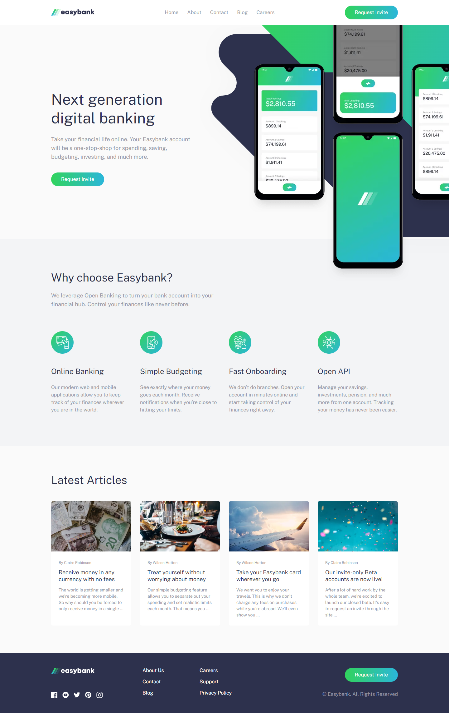

# Frontend Mentor - Easybank landing page solution

## Welcome! 👋

Thanks for checking out this front-end coding challenge solution.

## Table of contents

- [Overview](#overview)
  - [Preview Screenshot](#preview-screenshot)
  - [Links](#links)
- [My process](#my-process)
  - [Built with](#built-with)
- [Author](#author)

## Overview

This is a solution to the [Easybank landing page challenge on Frontend Mentor](https://www.frontendmentor.io/challenges/easybank-landing-page-WaUhkoDN). Frontend Mentor challenges help you improve your coding skills by building realistic projects.

### Preview Screenshot

### Links

- Solution URL: [github.com/lucasweidas/easybank-landing-page](https://github.com/lucasweidas/easybank-landing-page)
- Live Site URL: [easybank-landing-page.vercel](https://easybank-landing-page-virid-iota.vercel.app/)

## My process

### Built with

- NextJS
- React
- TypeScript
- Tailwind CSS
- Framer Motion

## Author

- Github - [@lucasweidas](https://github.com/lucasweidas)
- Frontend Mentor - [@lucasweidas](https://www.frontendmentor.io/profile/lucasweidas)
